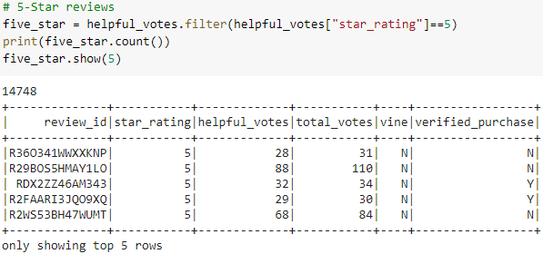
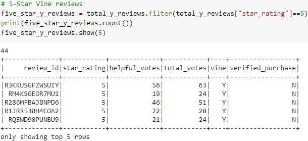
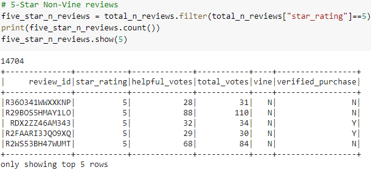
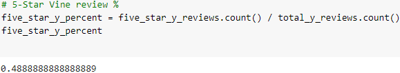
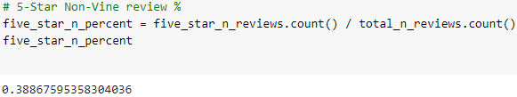

# Amazon_Vine_Analysis
## Purpose
The purpose of this project was to take a large amount of data, load it into an RDS, ETL through Colab, and then analyze the data to determine if there is a bias of Vine reviews.
## Results
### Total Reviews
 - Overall: 37921  

 - Vine Reviews: 90 (0.2%)  

 - Non-Vine Reviews: 37831 (99.8%)  

### Total 5-Star Reviews
 - Overall: 14748 (38.9% of total)  

 - Vine 5-Star Reviews: 44  

 - Non-Vine 5-Star Reviews: 14704  

### Percentage of 5-Star reviews by Vine Y/N
 - Vine 5-Star Review %: 48.9%  

 - Non-Vine 5-Star Review %: 38.9%  

