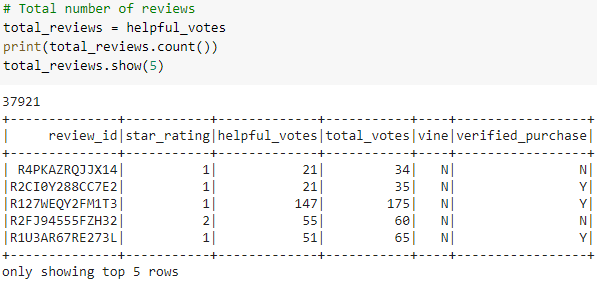
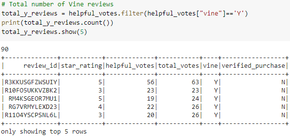
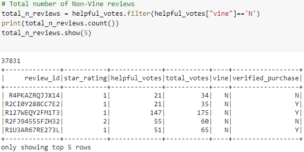

# Amazon_Vine_Analysis
## Purpose
The purpose of this project was to take a large amount of data, load it into an RDS, ETL through Colab, and then analyze the data to determine if there is a bias of Vine reviews.
## Results
### Total Reviews
 - Overall:  
 - Vine Reviews:  
 - Non-Vine Reviews:  
### Total 5-Star Reviews
 - Overall:  
 - Vine Reviews:  
 - Non-Vine Reviews:  
### Percentage of 5-Star reviews by Vine Y/N
 - Vine 5-Star %:  
 - Non-Vine 5-Star %:  
